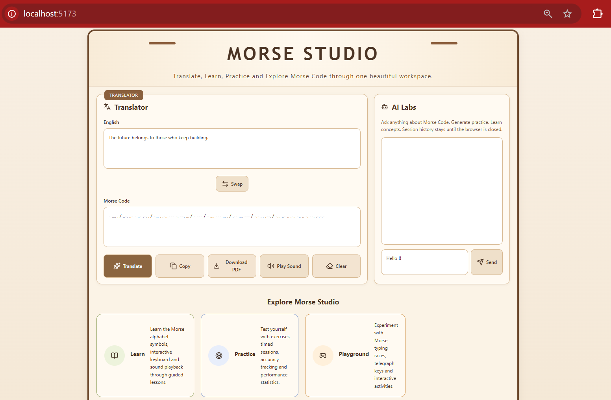

# Morse Studio

> Translate • Learn • Practice • Explore Morse Code in one interactive workspace.

Morse Studio is a modern web application designed to make Morse Code easy to understand and enjoyable to use. It combines a translator, audio playback, PDF export, AI assistance, and interactive learning modules into one platform.

---

## Preview



---

## Current Features

### Translator

- English → Morse Code
- Morse Code → English
- Auto translation
- Swap translation
- Copy translation
- Clear workspace

### PDF Export

- Download translations as a PDF
- Clean printable format
- Preserves both English and Morse output

### Audio Playback

- Play Morse Code using real dot and dash timings
- Browser-generated audio (no external audio files)

---

## Upcoming Modules

- 🤖 AI Labs (Gemini)
  - Ask questions about Morse Code
  - Generate practice exercises
  - Explain Morse concepts

- 📖 Learn
  - Interactive lessons
  - Morse alphabet
  - Keyboard trainer
  - Sound playback

- 🎯 Practice
  - Accuracy scoring
  - Session statistics
  - Timed exercises

- 🎮 Playground
  - Morse typing race
  - Telegraph simulator
  - Fun mini-games

- 📜 About Morse
  - History
  - Timeline
  - Modern applications
  - Vision behind Morse Studio

---

## Tech Stack

- HTML5
- CSS3
- JavaScript (ES Modules)
- Vite
- jsPDF
- Google Gemini API *(AI Labs - Coming Soon)*

---

## Folder Structure

```text
Morse-Studio
│
├── index.html
├── learn.html
├── practice.html
├── playground.html
├── about.html
│
├── assets
│   ├── css
│   ├── js
│   ├── data
│   ├── audio
│   ├── images
│   └── icons
│
├── docs
│   └── screenshots
│
└── README.md
```

---

## Installation

Clone the repository

```bash
git clone https://github.com/your-username/Morse-Studio.git
```

Install dependencies

```bash
npm install
```

Run the development server

```bash
npm run dev
```

---

## Project Status

Current Version

**v1.0 — Homepage Foundation**

Implemented

- ✅ Translator
- ✅ Morse Decoder
- ✅ PDF Export
- ✅ Morse Audio Playback

In Development

- 🚧 AI Labs
- 🚧 Learn
- 🚧 Practice
- 🚧 Playground
- 🚧 About Morse

---

## Vision

Morse Studio aims to become a complete learning and experimentation platform for Morse Code—not just a translator.

The goal is to make learning Morse Code interactive, enjoyable, and accessible through exploration, practice, audio, and modern web technologies.

---

## License

This project is licensed under the MIT License.